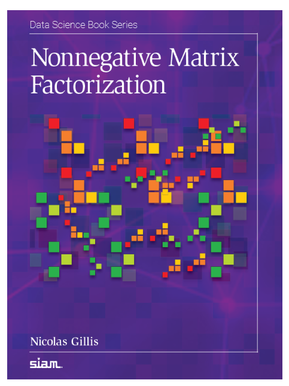

# NMF Book (Python) - Algorithms, Datasets, and Examples

### Project Description

This repository is a Python translation of the MATLAB companion code for the NMF book written by Nicolas Gillis.

It follows the original structure and re-implements core algorithms and demos so you can reproduce figures and experiments directly in Python.

### Reference book

<p align="center">
  
</p>

This repository is based on the MATLAB companion code for the book:

> Nicolas Gillis, *Nonnegative Matrix Factorization*, SIAM, Philadelphia, 2020.

```bibtex
@book{gillis2020nonnegative,
  title     = {Nonnegative Matrix Factorization},
  author    = {Gillis, Nicolas},
  year      = {2020},
  publisher = {SIAM, Philadelphia}
}
```

The original MATLAB package and the book webpage are available from the author's page:

<https://sites.google.com/site/nicolasgillis/book>

Please report questions about the original MATLAB code to `nicolas.gillis@umons.ac.be`.

Python translation and development: Valentin Leplat (`valentin.leplat@gmail.com`).

### Repository Structure

The codes of this NMF book are divided into 4 folders:

- `algorithms`: contains all the algorithms described in the book, for various NMF models.
- `data sets`: contains all the data sets used in the book.
- `examples by chapter`: contains the numerical examples from the book, classified chapter by chapter. They can be used to generate many figures presented in the book. This folder also contains some algorithms that are not NMF algorithms, for example lower bounds for the nonnegative rank.
- `utils`: contains useful functions used by several algorithms and examples.

### Examples of Implemented Algorithms (Python)

- Symmetric NMF via exact coordinate descent (`algorithms/symmetric_nmf/`)
  - Entry points: `symnmf(A, r, options)` and `SymNMFOptions`
- Frobenius NMF, 2-BCD with extrapolation (`algorithms/nmf/`)
  - Entry points: `fro_nmf(X, r, options)` and `FroNMFOptions`
  - Includes HALS/MU-based NNLS updates
- β-NMF with multiplicative updates and extrapolation (`algorithms/beta_nmf/`)
  - Entry points: `beta_nmf(X, r, options)` and `BetaNMFOptions`

Notes:

- Many MATLAB helpers are being ported progressively into Python under `utils/`.
- Some algorithms have optional coupled rescaling to stabilize magnitudes without changing the product `WH`, through the `rescale_every` option.

---

### Quick Start

This section explains how to install the Python version of the NMF book code from scratch.

#### Step 1: Install Python 3.9+

You need Python 3.9 or newer.

Check whether Python is already installed:

```bash
python3 --version
```

If this does not work, try:

```bash
python --version
```

On Windows, open PowerShell and try:

```powershell
py --version
python --version
```

If Python is not installed, download it from:

<https://www.python.org/downloads/>

During the installation on Windows, it is recommended to select:

```text
Add Python to PATH
```

#### Step 2: Download this repository

There are two simple ways to get the code.

##### Option A: clone with git

This is the recommended option if you already use Git.

```bash
git clone <repository-url>
cd <repository-folder>
```

For example:

```bash
git clone https://github.com/<your-github-username>/<repository-name>.git
cd <repository-name>
```

On Windows PowerShell, the commands are the same:

```powershell
git clone https://github.com/<your-github-username>/<repository-name>.git
cd <repository-name>
```

Replace the repository address above by the actual URL of this GitHub repository.

##### Option B: download ZIP

This option does not require Git.

1. Open the GitHub repository page.
2. Click **Code**.
3. Click **Download ZIP**.
4. Extract the ZIP file.
5. Open a terminal in the extracted folder.

To open a terminal in the extracted folder:

- On macOS or Linux, right-click in the folder and choose **Open in Terminal**, or open a terminal and use `cd`.
- On Windows, open the folder, click the address bar, type `powershell`, and press Enter.

#### Step 3: Create a virtual environment

A virtual environment keeps the Python packages for this project separate from the rest of your system.

From the repository root, run:

```bash
python3 -m venv .venv
source .venv/bin/activate
python -m pip install --upgrade pip
```

On Windows PowerShell:

```powershell
py -m venv .venv
.\.venv\Scripts\Activate.ps1
python -m pip install --upgrade pip
```

On Windows `cmd.exe`:

```bat
py -m venv .venv
.venv\Scripts\activate.bat
python -m pip install --upgrade pip
```

If PowerShell refuses to activate the environment, run:

```powershell
Set-ExecutionPolicy -Scope CurrentUser RemoteSigned
```

Then try again:

```powershell
.\.venv\Scripts\Activate.ps1
```

#### Step 4: Install the required packages

Once the virtual environment is activated, install the required Python packages:

```bash
python -m pip install -r requirements.txt
```

On Windows PowerShell:

```powershell
python -m pip install -r requirements.txt
```

#### Step 5: Run a first example

You can now run one of the examples.

For example, run the symmetric NMF random demo:

```bash
python -m algorithms.symmetric_nmf.runme_random
```

You can also run one of the chapter examples:

```bash
python "examples by chapter/Chapter 1 - Introduction/CBCL.py"
```

Generated figures are saved under `figs/`.

#### Optional: headless mode

If you run the code on a server, or in an environment without a graphical interface, set a non-interactive plotting backend.

On macOS or Linux:

```bash
export MPLBACKEND=Agg
```

On Windows PowerShell:

```powershell
$env:MPLBACKEND = "Agg"
```

#### Leaving the virtual environment

When you are done, run:

```bash
deactivate
```

---

### How to Use

You can import and use algorithms in your own scripts, or run the provided chapter demos.

The examples compute the project base path dynamically, so you can run them from anywhere.

#### Symmetric NMF, random demo

```bash
source .venv/bin/activate
python -m algorithms.symmetric_nmf.runme_random
```

On Windows PowerShell:

```powershell
.\.venv\Scripts\Activate.ps1
python -m algorithms.symmetric_nmf.runme_random
```

Figures are saved under `figs/`.

#### Chapter 1 - CBCL faces, Frobenius NMF

```bash
source .venv/bin/activate
python "examples by chapter/Chapter 1 - Introduction/CBCL.py"
```

On Windows PowerShell:

```powershell
.\.venv\Scripts\Activate.ps1
python "examples by chapter/Chapter 1 - Introduction/CBCL.py"
```

This generates a grid of sample faces, the average face, basis faces from NMF, and the error-vs-time plot in `figs/`.

#### Chapter 1 - Mary has a little lamb, β-NMF with KL divergence

```bash
source .venv/bin/activate
python "examples by chapter/Chapter 1 - Introduction/Mary_piano.py"
```

On Windows PowerShell:

```powershell
.\.venv\Scripts\Activate.ps1
python "examples by chapter/Chapter 1 - Introduction/Mary_piano.py"
```

This generates activation plots, frequency-response plots, and the objective value per iteration in `figs/`.

#### Chapter 1 - Swimmer (parts-based factorizations)

```bash
source .venv/bin/activate
python "examples by chapter/Chapter 1 - Introduction/Swimmer.py"
```

Generates:
- `swimmer_samples.pdf`: grid of sample images,
- `swimmer_basis_nmf.pdf`: basis images from standard Fro-NMF (r=17),
- `swimmer_basis_snpa.pdf`: basis images from separable NMF (SNPA).

#### Chapter 1 - TDT2 topics (Fro-NMF)

```bash
source .venv/bin/activate
python "examples by chapter/Chapter 1 - Introduction/tdt2_top30.py"
```

Generates:
- `tdt2_topics_heatmap.pdf`: H row-normalized, documents grouped by dominant topic,
- `tdt2_topics_top10_words.pdf` (if `words` are available in the MAT file),
- `tdt2_error_vs_time.pdf`: objective vs. time for Fro-NMF.

#### Chapter 1 - Urban hyperspectral (hierarchical rank-two NMF)

```bash
source .venv/bin/activate
python "examples by chapter/Chapter 1 - Introduction/Urban.py"
```

Generates:
- `urban_basis_spectra.pdf`: basis spectra (columns of W),
- `urban_abundances_maps.pdf`: abundance maps (rows of H reshaped 307x307) via `utils/affichage`.

#### Chapter 2 - Exact NMF: nested hexagons and geometric view

```bash
source .venv/bin/activate
python "examples by chapter/Chapter 2 - Exact NMF/ExactNMF_nested_hexagons.py"
```

What this does (per MATLAB doc, Chapter 2 - Exact NMF):
- Builds the 6×6 matrix \(X_a\) that models two nested regular hexagons; parameter a ∈ (1, +∞].
- The nonnegative rank depends on a:
  - if a ≤ 2, rank₊(Xₐ) = 3
  - if a ≤ 3, rank₊(Xₐ) = 4
  - else, rank₊(Xₐ) = 5
  - for a = +∞, a limiting 0–1 matrix is used (rank₊ = 5)
- Runs an Exact NMF heuristic to compute an exact factorization Xₐ = W H (up to tolerance).
- Displays the geometric interpretation for the rank-3 case: a 2D nested-polytope (NPP) instance
  showing the outer polygon (Δ⁶ ∩ col(Xₐ)) and the inner polygon (conv(Xₐ)), as in the book.

Generated figures:
- `exactnmf_nested_hexagons_polygons.pdf`: outer vs. inner polygon in 2D (when applicable).
 - `exactnmf_nested_hexagons_convW.pdf`: 2D view of conv(W) when rank(W) ≤ 3.
 
#### Chapter 3 - Nonnegative rank

- UDISJ (unique disjointness) matrix and lower bounds

  ```bash
  python "examples by chapter/Chapter 3 - Nonnegative rank/UDISJ.py"
  ```

  What this does (per MATLAB doc, Chapter 3):
  - Generates the 2^n×2^n UDISJ matrix (default n=3),
  - Attempts an Exact NMF with r = 2^n−1 using a brief heuristic (for illustration),
  - Prints lower bounds on rank₊(X): rectangle covering, geometric, nonnegative nuclear norm, self‑scaled, hyperplane separation.

- Regular octagon slack matrix and lower bounds

  ```bash
  python "examples by chapter/Chapter 3 - Nonnegative rank/bound_nnr_octagon.py"
  ```

  What this does:
  - Builds the slack matrix of the regular octagon from Ax≤b and the vertices,
  - Verifies a known exact NMF S=WH,
  - Prints the rectangle covering bound and SDP-based bounds.

- Linear EDM bounds X(i,j) = (i−j)^2

  ```bash
  python "examples by chapter/Chapter 3 - Nonnegative rank/bound_nnr_linEDM.py"
  ```

  What this does:
  - Constructs the “linear EDM” X of size n=6 with X(i,j)=(i−j)^2,
  - Compares lower bounds for rank₊(X).

- Rectangle covering for linear EDM

  ```bash
  python "examples by chapter/Chapter 3 - Nonnegative rank/rec_cov_linEDM.py"
  ```

  What this does:
  - Computes the rectangle covering bound for X (n=6), and lists covering rectangles.

- Thomas’s 4×4 example and lower bounds

  ```bash
  python "examples by chapter/Chapter 3 - Nonnegative rank/bound_nnr_Thomas.py"
  ```

  What this does:
  - Applies lower bounds to a 4×4 binary example matrix from the chapter.
 
Notes:
- The default script uses a = 3 (so rank₊ = 4). Edit the `a` value at the top of the script to
  reproduce other cases from the book (e.g., a = 2, a = 2.5, a = np.inf).
- The 2D swap and column/row rescaling follow the MATLAB script logic to enable planar display.

#### Chapter 4 - Identifiability

- SSC1 necessary condition illustration (Figure 4.6)

  ```bash
  # Optional: control trials per grid point (default 100)
  NATTEMPTS=100 python "examples by chapter/Chapter 4 - Identifiability/SSC1_nec_cond_illus.py"
  ```

  What this does (per MATLAB doc, Chapter 4):
  - Draws random nonnegative matrices H with sprand-like sparsity (rank r, density d),
  - Tests the necessary condition for SSC1 via NNLS feasibility for all e − e_k,
  - Displays a heatmap of success rates over (r, d), saved as:
    - `ch4_ssc1_nec_cond_illus.pdf`

- SSC on a 4×6 2-sparse matrix (Example 4.29)

  ```bash
  python "examples by chapter/Chapter 4 - Identifiability/checkSSC_H46_2sparse.py"
  ```

  What this does:
  - Checks the necessary condition for SSC1 and computes an optimal vertex `x*` of:
    - maximize ||x||² subject to Hᵀ x ≥ 0, eᵀ x = 1
  - Prints whether SSC1 holds (||x*||² ≤ 1) and whether SSC2 holds (x* must be a unit vector e_k).

- Min-volume NMF on Urban (r = 6) — Models 1–3

  ```bash
  python "examples by chapter/Chapter 4 - Identifiability/minvolNMF_Urban.py"
  ```

  Generates:
  - `ch4_minvol_urban_maps_1.pdf`, `ch4_minvol_urban_maps_2.pdf`, `ch4_minvol_urban_maps_3.pdf`: abundance maps,
  - `ch4_minvol_urban_spectra.pdf`: basis spectra for the three models.

- Min-volume NMF on Moffet (r = 3) — Models 1 and 4

  ```bash
  python "examples by chapter/Chapter 4 - Identifiability/minvolNMF_Moffet.py"
  ```

  Generates:
  - `ch4_minvol_moffet_maps_HtE_le_e.pdf`, `ch4_minvol_moffet_maps_HtE_eq_e.pdf`: abundance maps,
  - `ch4_minvol_moffet_spectra.pdf`: basis spectra; also prints column-sum diagnostics for H.

- ONMF (orthogonal NMF) on CBCL (r = 49)

  ```bash
  python "examples by chapter/Chapter 4 - Identifiability/ONMF_CBCL.py"
  ```

  Generates:
  - `ch4_onmf_cbcl_basis.pdf`: basis images (from Hᵀ),
  - `ch4_onmf_cbcl_error.pdf`: relative error per iteration.

- ONMF (orthogonal NMF) on Urban (r = 6)

  ```bash
  python "examples by chapter/Chapter 4 - Identifiability/ONMF_Urban.py"
  ```

  Generates:
  - `ch4_onmf_urban_maps.pdf`: abundance maps (rows of H reshaped 307×307; MATLAB order replicated),
  - `ch4_onmf_urban_error.pdf`: relative error per iteration.

#### Chapter 5 - NMF models (CBCL and Urban)

CBCL demos (face basis extraction), mirroring MATLAB Chapter 5 scripts:

- Projective NMF on CBCL (Fig. 5.3)

```bash
python "examples by chapter/Chapter 5 - NMF models/CBCL_projectiveNMF.py"
```

Generates:
- `cbcl_projective_init_spa.pdf`: SPA initialization basis (W0)
- `cbcl_projective_basis.pdf`: projective NMF basis (W)
- `cbcl_projective_error.pdf`: objective vs. iterations (||X − W Wᵀ X||_F)

- Semi-NMF on CBCL (Fig. 5.4)

```bash
python "examples by chapter/Chapter 5 - NMF models/CBCL_semiNMF.py"
```

Generates:
- `cbcl_seminmf_basis.pdf`: semi-NMF basis elements (19×19)

- Sparse NMF on CBCL (Fig. 5.5)

```bash
python "examples by chapter/Chapter 5 - NMF models/CBCL_sparseNMF.py"
```

Generates:
- `cbcl_sparse_nmf_basis.pdf`: baseline NMF basis (no sparsity)
- `cbcl_sparse_nmf_basis_sparse.pdf`: sparse NMF basis (sW=0.85)

- Recursive NMU on CBCL (Fig. 5.6)

```bash
python "examples by chapter/Chapter 5 - NMF models/CBCL_NMU.py"
```

Generates:
- `cbcl_nmu_basis.pdf`: NMU basis maps (49 components)

- Tri-NMF on CBCL (Fig. 5.10)

```bash
python "examples by chapter/Chapter 5 - NMF models/CBCL_triNMF.py"
```

Generates:
- `cbcl_trinmf_W1.pdf`: first layer basis `W1`
- `cbcl_trinmf_W1W2.pdf`: product `W1 W2`

Urban demo (projective NMF), mirroring MATLAB ProjectiveNMF_Urban.m (Fig. 5.2):

```bash
python "examples by chapter/Chapter 5 - NMF models/ProjectiveNMF_Urban.py"
```

Generates:
- `projective_urban_maps.pdf`: abundance maps (W as 307×307 images)
- `projective_urban_error.pdf`: normalized error vs. iterations

Example 5.1 (β-NMF under/over-approximation trends):

```bash
python "examples by chapter/Chapter 5 - NMF models/Example51.py"
```

Prints average proportions of positive/negative residual parts for IS-NMF (β=0) vs. Fro-NMF (β=2) across random matrices, reproducing the trends described in the book.

#### Chapter 5 - Karate graph, symmetric NMF demo

```bash
source .venv/bin/activate
python "examples by chapter/Chapter 5 - NMF models/symNMF_karate.py"
```

On Windows PowerShell:

```powershell
.\.venv\Scripts\Activate.ps1
python "examples by chapter/Chapter 5 - NMF models/symNMF_karate.py"
```

This generates:

- rank-1 term heatmaps,
- the adjacency matrix, before and after community reordering,
- the `H H^T` heatmap,
- a community graph visualization.

All figures are saved under `figs/`.

#### Chapter 8 - NMF algorithms

- MU vs. modified MU (Figure 8.2)

  ```bash
  python "examples by chapter/Chapter 8 - NMF algorithms/MU_vs_modifiedMU.py"
  ```

  What this does:
  - Compares standard MU (ε=0) vs. modified MU (ε=machine eps) on a sparse random matrix (m=500, n=1000, r=40, density=1%).
  - Plots the error per iteration with MATLAB-like axis scaling [30, 100, em(100), es(30)].

  Generates:
  - `ch8_mu_vs_modifiedmu.pdf`

- MU vs. extrapolated MUe (β=3/2) on CBCL (Section 8, paper ref. Hien–Leplat–Gillis 2024)

  ```bash
  python "examples by chapter/Chapter 8 - NMF algorithms/MU_vs_extrapolatedMU.py"
  ```

  What this does:
  - Loads CBCL (r=49), initializes W,H with a 1‑step MU improvement, then runs:
    - MU without extrapolation,
    - MUe with Nesterov‑type extrapolation.
  - Displays semilog curves of the normalized β‑divergence vs. iterations.

  Generates:
  - `ch8_mu_vs_extrapolatedmu.pdf`

- A‑HALS with SNPA init vs. random init on CBCL (Figure 8.5)

  ```bash
  python "examples by chapter/Chapter 8 - NMF algorithms/FroNMF_init_randvsSNPA.py"
  ```

  What this does:
  - Runs A‑HALS (Fro‑NMF) with:
    - SNPA initialization (on Xᵀ): `W0` from SNPA, `H0 = X[K,:]`,
    - random initialization,
  - Time budget 5 seconds (book figure uses 5 s).

  Generates:
  - `ch8_fronmf_init_rand_vs_snpa.pdf`

- Algorithm comparison on multiple datasets (Figures 8.3–8.4)

  ```bash
  python "examples by chapter/Chapter 8 - NMF algorithms/FroNMF_algo_comparison.py"
  ```

  What this does:
  - Compares MU (1 inner iter), A‑MU (100 inner iters), ALS, A‑HALS, E‑A‑HALS, FPGM, and AO‑ADMM.
  - Dataset selection is via `experience` at the top of the script:
    - 1: CBCL, r=49; 2: CBCL, r=10; 3: classic, r=30; 4: TDT2, r=30.
  - Time budget set to 5 s for quick runs (book uses 30 s); uses `utils/sumte.py` to average errors on a common time grid.

  Generates:
  - `ch8_fronmf_algo_comparison_subset.pdf`

#### Chapter 9 - Applications

- Raman SMCR (Section 9.3)

  ```bash
  python "examples by chapter/Chapter 9 - Applications/Raman.py"
  ```

  Generates:
  - `raman_W_spectra.pdf`: columns of `W` as spectral signatures vs. wavenumber (cm⁻¹),
  - `raman_H_timecourses.pdf`: rows of `H` as concentration over time (0:1/3:50 s).

  Notes:
  - Data: `data sets/RamanSMCR.mat` with variables `W` (m×r) and `H` (r×n).
  - The wavenumber axis starts at 280 as in the MATLAB script.

- Microarray (Section 9.4)

  ```bash
  python "examples by chapter/Chapter 9 - Applications/Microarray.py"
  ```

  What this does:
  - Loads the interferon beta gene microarray dataset `data sets/microarrayIFNbeta.mat` (variable `X`).
  - Selects r = 3.
  - Initializes with SNPA (selected columns of `X` as `W0`, corresponding `H0`), then runs Fro-NMF (HALS, 100 iters, β₀ = 0).
  - Column-wise normalizes `W` by its max per column, pushing the scale into `H` (faithful to MATLAB).

  Generates:
  - `microarray_W.pdf`: basis matrix `W` (grayscale heatmap).

- Recommender system (Section 9.5)

  ```bash
  python "examples by chapter/Chapter 9 - Applications/RecomSys.py"
  ```

  What this does:
  - Uses the 6×5 toy rating matrix from the book; zeros indicate missing entries.
  - Solves weighted low-rank approximation with nonnegativity constraints (Weighted NMF) and missing-data mask `P = (X>0)`.
  - Re-initializes until the reconstructed entries lie within [0.5, 6.5], then normalizes `W` columns to [0, 5] (scaling propagated to `H`), as in MATLAB.
  - Prints `W`, `H`, the weighted RMSE on observed entries, and the approximation `W@H`.

  Notes:
  - The problem is highly initialization-sensitive (see Gillis & Glineur, SIAM SIMAX 2011). You will not necessarily reproduce the same numeric factors as in the book, but the script follows the exact MATLAB procedure.


---

### Data

MAT files are provided in `data sets/`.

The examples load these files directly, for example:

- `CBCL.mat`
- `piano_Mary.mat`
- `karate.mat`

If you add new datasets, place them in `data sets/` and adjust the example scripts if variable names differ from expectations.

---

### Troubleshooting

#### `ModuleNotFoundError: No module named 'algorithms'`

Make sure that you run the examples from the repository root, or that the repository root is on your Python path.

The provided examples automatically add the repository root to `sys.path`. If you run Python from another folder or from your own scripts, you may need to run from the repository root or set `PYTHONPATH`.

On macOS or Linux:

```bash
export PYTHONPATH=/path/to/repository
```

On Windows PowerShell:

```powershell
$env:PYTHONPATH = "C:\path\to\repository"
```

#### Plotting does not work on a server

If you run the code in a headless environment, set:

```bash
export MPLBACKEND=Agg
```

On Windows PowerShell:

```powershell
$env:MPLBACKEND = "Agg"
```

#### Large-value runtime warnings in β=1, KL updates

Occasional `divide` or `overflow` warnings can happen when `WH` has very small entries.

Possible fixes:

- increase `epsilon` in `BetaNMFOptions`, for example to `1e-8`,
- enable `rescale_every`,
- wrap KL computations with `np.errstate` in custom scripts.

#### The virtual environment is not activated

After activation, your terminal prompt usually starts with:

```text
(.venv)
```

You can also check which Python is used.

On macOS or Linux:

```bash
which python
```

On Windows PowerShell:

```powershell
where python
```

---

### Contributing

- Python code mirrors the MATLAB structure as much as possible.
- When porting functions, keep interfaces and behavior faithful to the original code.
- Add small numerical safeguards where needed.
- Use a local virtual environment.
- Install dependencies with:

```bash
python -m pip install -r requirements.txt
```

- Save figures to `figs/` with `bbox_inches="tight"` for consistency.

---

### Credits

- Original MATLAB code and book: Nicolas Gillis and collaborators.
- Python translation and development: Valentin Leplat (`valentin.leplat@gmail.com`).
- For questions about the original MATLAB code: `nicolas.gillis@umons.ac.be`.
